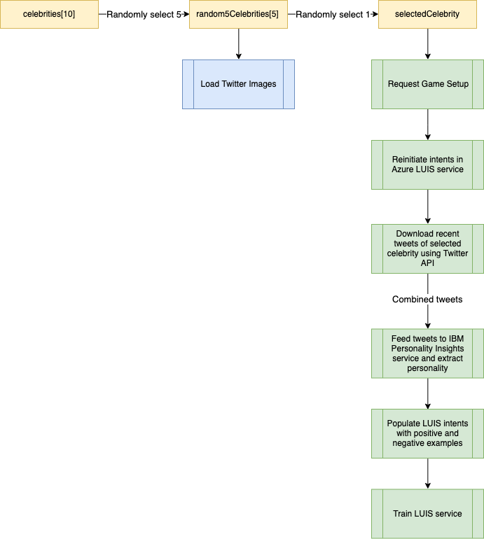
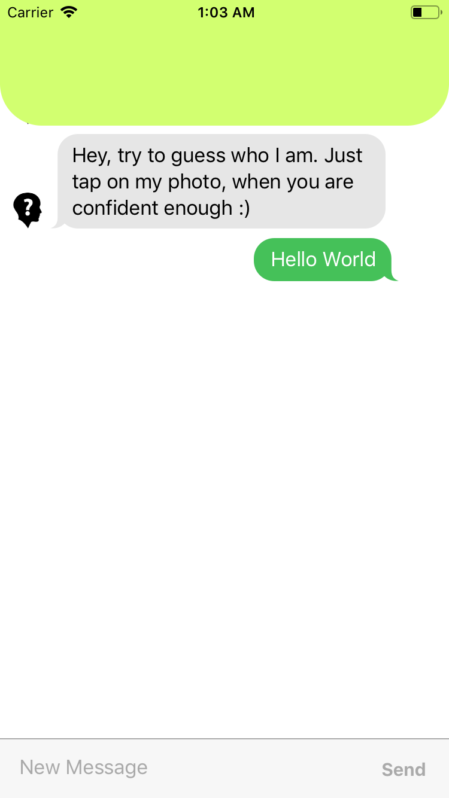
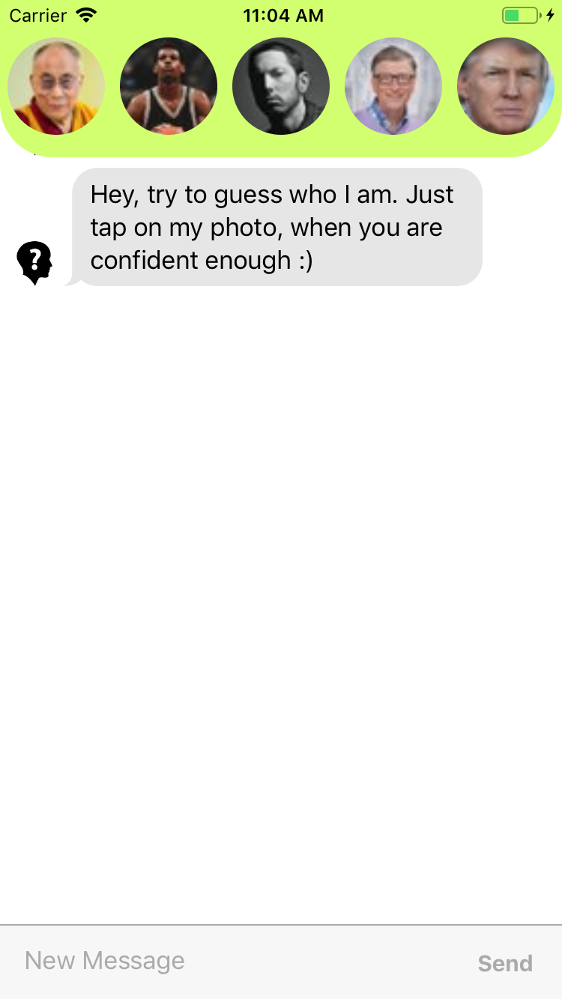

# Guess Who Game

## Overview

In this tutorial, you will be using the IBM Watson Personality Insight Service and the Microsoft Azure Language Understanding Intelligent Service (LUIS) to create a mobile version of the classic 2 player board game Guess Who.

The game works by having the system selecting a celebrity from 10 pre-selected twitter accounts and training it to understand and mimic their personality.

Then, the user will have to chat with the system and try to figure out which celebrity it is from the available list at the top. The player will have 2 tries to guess.

After completing this tutorial, you should have a good understanding of how the personality insight service work and a general overview of how to implement them into any application of your choice.

Below you’ll find a figure that outlines the pipeline of the application and a general overview of how the components interact with each other.

This tutorial should take about 1 - 3 hours to complete.

<br />

<span style="display:block;text-align:center">

</span>


## Contents

* [Requirements](#requirements)
* [Before you begin](#before-you-begin)
* [Twitter Configuration](#twitter-configuration)
* [IBM Personality Insights](#ibm-personality-insights)
* [Language Understanding Intelligent Service (LUIS)](#language-understanding-intelligent-service-luis)
* [Services Integration](#services-integration)
* [Limitations](#limitations-and-future-work)

## Requirements

- Xcode 9.3+
- Swift 4.2+
- iOS 10.0+
- Understanding the basics of RESTful APIs

## Before You Begin

### iOS Application

Clone or Download the getting started iOS project

To Run the mobile application, navigate to the root of the project, open your terminal and follow the steps below:

**1. Install Cocoapods**

```sh
$ sudo gem install cocoapods
```

**2. Run the Podfile**

To install the required dependecies, run the following command in your terminal:

```sh
$ pod install
```

**3. Open the Workspace**

Open the `GuessWho.xcworkspace` file with `Xcode` program.

**4. Run the Application**

Click on run button at top left side of Xcode or press `⌘ + R` on your keyboard.

If everything was done correctly, you should see the initial application UI and type a message:

**Getting Started UI**



Now you are ready to configure the application's services.

## Twitter Configuration

The Twitter service was already implemented and provided with initial project. However, you need to finalize its configuration:

**1. Twitter Account**

Create new or Log-in to your existing Twitter account, then go to [Developer Dashboard](https://developer.twitter.com/content/developer-twitter/en.html) and click `Apps` in the top right corner.

**2. Get API Keys**

Navigate to the `key and token` section.

For this project, we will just need `Consumer API keys`.

**3. Insert API Keys into App**

Go to the recently downloaded `getting-started project` and open `project navigator` on the left.

Navigate to Resources folder and open `EnvVariables.plist` file.

Copy and paste both Consumer API key and Consumer API secret key into the appropriate section.

**4. Verify Twitter Service**

Navigate to `AppDelegate.swift` and uncomment the following lines of code:

```swift
TWTRTwitter.sharedInstance().start(withConsumerKey: retrieveEnvVariable(for: "TwitterConsumerKey"),consumerSecret: retrieveEnvVariable(for: "TwitterConsumerSecret"))
```

Now, go to `ViewController.swift` file, find `setupGame()` function and add the following line under  the TODO comment:

```swift
self.loadImages(random5Celebrities)
```

Run the application.

If everything is done correctly, you should see 5 different celebrity images appear at the top of the screen as shown below:



If needed, you can take the time to go through the `TwitterService.swift` to get a better understand how it works.

## IBM Personality Insights

The IBM Watson Personality Insights service extracts insights about personality from social media platforms, enterprise data, or other forms of digital communications. In this case, we are able to use this service to analyze the personality of a selected celebrity based on their recent tweets.

### Setting-Up Personality Insights Service

**1. IBM Account**

Create a new or Log in to your existing [IBM Cloud](https://cloud.ibm.com/login) account.

**2. Personality Insights Service**

From the dashboard, click on `Create resource` and search for `Personality Insights`.

Provision an instance of Language Translator under the `Lite` plan.

Navigate to `Manage` tab inside your Personality Insights service and grab the API Key.

**3. Inserting API Key into App**

Navigate to Resources folder and open `EnvVariables.plist` file again.

Insert Personality Insights API Key into the appropriate section.

### Personality Insights Overview

In this section you can read how IBM Watson Personality Insights service works in a little more detail:

**1. Personality Insights API**

To analyze any content and retrieve the personality profile, we simply need to use the HTTP POST request method to call the /v3/profile method of the Personality Insights service.

We can provide up to `20 MB` of content to be analyzed via the body of the request. Though, in order to make an accurate analysis, the Personality Insights service needs only `3000 words` of input, and `more content` does not really contribute to the accuracy of the profile. That is why we are getting just the `first 5 pages` of tweets in the Twitter service configuration above.

Personality Insights accepts 4 different formats of the passed content:

| Format | Argument |
| :---: | :---: |
| Plain text | text/plain |
| HTML | text/html |
| JSON | application/json |
| CSV | text/csv |

In our case, we will provide a `Plain text` format since we are combining all the obtained tweets into one big string.

We can also specify the request and response language. You can use any combination of IBM Watson's supported languages, but this tutorial we will use `default English`.

**2. Understanding the Profile Object**

Let's go over the high-level output of a Profile object to better understand its structure:

```json
{
  "word_count": 3000,
  "processed_language": "en",
  "personality": [
     ...
  ],
  "needs": [
     ...
  ],
  "values": [
     ...
  ],
  "behavior": [
     ...
  ],
  "consumption_preferences": [
     ...
   ],
  "warnings": []
}
```

The output always includes the `personality`, `needs`, and `values` fields. In order to get `behavior` and `consumption_preferences` fields, we would need to specify it in the request.

Before proceeding to the implementation, we need to understand the purpose of each of these personality fields:

| Field | Purpose |
| :---: | ------- |
| personality |  Recursive array of Trait objects that describes the Big Five five factors of personality and facets with a % probability of each |
| needs |  Array of Trait objects that describes the Needs |
| values | Array of Trait objects that describes the Values|
| behavior | Array of Behavior objects that describes the distribution of the content over the days of the week and the hours of the day. |
| consumption_preferences | Array of ConsumptionPreferencesCategory objects that provides results for each category of consumption preferences. Indicates preferences of the analyzed persona.|

In order to fulfill the requirements of the Guess Who game, we will only need `personality` and `consumption_preferences` fields.

### Personality Insights in Swift

Now, with the understanding of all the required aspects of the IBM Watson Personality Insight, we can implement this service in our Guess Who game project:

**1. Initialize**

Navigate to `PersonalityService.swift` file where you should see an empty class and already imported Personality Class library:

```swift
import Foundation
import PersonalityInsights

class PersonalityService {}
```

Update the starter `PersonalityService` class to the following:

```swift
class PersonalityService {
    
    private let apiKey: String!
    
    // Using the latest date for the most latest version
    private let version = "2019-04-12"
    
    private var personalityInsights: PersonalityInsights!
    private var personalityDict: Dictionary<String, Dictionary<String, String>>!
    
    
    init() {
        
        // Retrieve API Key and initialize Personality Insights
        self.apiKey = retrieveEnvVariable(for: "WatsonPersonalityInsightsApiKey")
        self.personalityInsights = PersonalityInsights(version: self.version, apiKey: self.apiKey)
        
        // Load Personality Traits JSON and populate the dictionary
        self.retrievePersonalityDict()
    }
    
    
    //: Obtain the low and high description for each subcategory of Big Five characteristics
    private func retrievePersonalityDict() {
        
        self.personalityDict = Dictionary<String, Dictionary<String, String>>()
        
        if let path = Bundle.main.path(forResource: "PersonalityTraits", ofType: "json") {
            
            do {
                
                let data = try Data(contentsOf: URL(fileURLWithPath: path), options: .mappedIfSafe)
                let jsonResult = try JSONSerialization.jsonObject(with: data, options: .mutableLeaves)
                
                if let jsonResult = jsonResult as? Dictionary<String, AnyObject> {
                    
                    // Get personality object
                    let personalityTrait = jsonResult["personality"] as! Dictionary<String, AnyObject>
                    
                    for personality in personalityTrait {
                        
                        personalityDict[personality.key] = personality.value as? Dictionary<String, String>
                    }
                }
            }
            catch {
                
                print(error.localizedDescription)
            }
        }
    }
}
```

Here we initialize our Personality Insights service as well as load Personality Traits characteristics.

The purpose of `Personality Traits JSON file` is to provide the text description for each personality characteristic. If you review the [Personality Insights Demo](https://personality-insights-demo.ng.bluemix.net) provided by IBM Watson, you will see how the `Profile Summary` is generated in the output. This summary description is not included in the API call and is generated on the client side of the demo. Therefore, we will follow the same approach in our game and map personality descriptions borrowed from [IBM Demo Client Side](https://github.com/watson-developer-cloud/personality-insights-nodejs/blob/master/public/js/components/personality-text-summary.standalone.js), to appropriate personality categories retrieved from API call.

**2. Personality Insights API Call**

Now go ahead and add the following method in the PersonalityService class:

```swift
//: Makes an API call to the Personality Insights Service with the arguments
//: Note that we provide a simple String as an argument for the method since we are making API call with a plain text format
public func getProfile(_ text: String, _ completion: @escaping (_ profileSummary: (positive: [String], negative: [String])) -> Void) {
    
    // API call with a plain text format
    let profileContent = ProfileContent.text(text)
    
    // Make sure that consumptionPreferences argument and rawScores are set to TRUE
    self.personalityInsights.profile(profileContent: profileContent, contentLanguage: "en", acceptLanguage: nil,
                                        rawScores: true, consumptionPreferences: true, headers: nil) { response, error in
                                        
        if let error = error {
            
            print(error)
        }
        
        // Catch error
        guard let profile = response?.result else {
            
            print("Failed to generate profile")
            return
        }
        
        // Pass retrieved profile to the summary generation method
        completion(self.getProfileSummary(profile))
    }
}
```

This is the main function where the communication between the game and IBM Watson Personality Insights happens. The implementation is very simple since we are using the Swift SDK and just need to call the pre-built methods. If you have already added this chunk of code, you are probably curious about the missing function inside the completion callback. That will be covered next.

**3. Profile Summary Generation**

Finally, let's add this missing and very important function to the class to finish with Personality Insights service setup:

```swift
//: Map personality categories to the JSON and get positive and negative traits
private func getProfileSummary(_ profile: Profile) -> (positive: [String], negative: [String]) {
    
    var positive = Array<String>()
    var negative = Array<String>()
    let positiveThreshold = 0.7
    
    
    // Obtain only personality and consumption_preferences fields
    let personalities = profile.personality;
    let consumptionPreferences = profile.consumptionPreferences;
    
    // Map personalities and add them to corresponding arrays
    for personality in personalities {
        
        for child in personality.children! {
            
            if let temp = self.personalityDict[child.name.replacingOccurrences(of: " ", with: "-")] {
                
                if child.percentile > positiveThreshold {
                    
                    positive.append(temp["HighDescription"]!)
                }
                else {
                    
                    negative.append(temp["LowDescription"]!)
                }
            }
        }
    }
    
    // Add consumption_preferences to corresponding arrays
    for consumption in consumptionPreferences! {
        
        for value in consumption.consumptionPreferences {
            
            var name = value.name.replacingOccurrences(of: "Likely to like ", with: "")
            name = name.replacingOccurrences(of: "Likely to ", with: "")
            
            if value.score > positiveThreshold {
                
                positive.append(name)
            }
            else {
                
                negative.append(name)
            }
        }
    }
    
    // Return a tuple of positive and negative traits arrays
    return (positive: positive, negative: negative)
}
```

As was mentioned earlier, the purpose of this method is to map personality categories to their descriptions. The key factor here is the `positive threshold variable` which is equal to `0.7`. It means that if there is a 70% confidence that analyzed persona has this characteristic, then it will be considered as a positive trait and negative otherwise. The same logic is applied to the consumption preferences field. The reason for such a high threshold is to select the most precise characteristics for each celebrity to maximally differentiate him/her from other individuals.

Now that's all we need to set up for the IBM Watson Personality Insights. You will see how it will be used in the [Services Integration](#services-integration) section.

## Language Understanding Intelligent Service (LUIS)

LUIS is a cloud-based API service that applies custom machine-learning intelligence to natural language text to predict overall meaning and understand relevant detailed information.

We apply LUIS service to our game in order to create the chat bot that will be trained on the obtained personality and thus, speaks on behalf of the randomly selected celebrity.

### Setting-Up the LUIS Service

**1. LUIS Portal Account**

Create new or Log in to your existing LUIS account created on the [LUIS portal](https://www.luis.ai/home)

**2. LUIS Service**

Select Create a new app

In the popped up dialog box, enter the name of your application, `GuessWho`.

Choose the English application culture and click `Done`.

In the top right corner click `Publish`. LUIS application must be published in order to be accessed through the API and HTTP requests.

**3. Adding Credentials into the App**

Navigate to the `Manage` tab at the top of the screen and then, copy and paste the `Application ID` into the `EnvVariables.plist`.

Then, navigate to the `Keys and Endpoints` tab on the left side, and copy and paste the `Authoring Key` into `EnvVariables.plist` as well.

In the `EnvVariables.plist` find `LuisAppVersion` section and input the initial `0.1` app version.

### LUIS Overview

Below you can read how LUIS service works in more detail:

**1. LUIS Background**

LUIS, as a REST API and can be used with any product, service or framework that makes an HTTP request without SDK installation. It also supports many of the additional Microsoft products and services such as QnA Maker, Bing Spell Check, and Speech service.

**2. LUIS RESTful API**

LUIS Service can be updated and trained programmatically through the API calls without logging to the Dashboard. That is another reason why this project uses LUIS service to build a Guess Who game with conversation feature.

Although these API calls might be a little tricky and is required to be called in a particular order, especially in our game.

LUIS-Programmatic provides over 50 different API endpoints, but we are not going to use all of them.

Essentially we will need the followings:

| Operation API | Purpose |
| :-----------: | ------- |
| List Intents | Retrieves the list of all the intents currently used in the LUIS App. It provides `intents IDs` which we will use to delete the old intents. |
| Delete Intent | Deletes an intent with the specified ID which we can get from the first operation. |
| Add Intent | Adds a new intent LUIS APP with the specified name. |
| Add Utterances | Populates intents with provided examples. |
| Train Version | Sends a training POST request for a version of a specified LUIS app. This  |
| Get Status | Gets the training status of all models for the specified LUIS app. This API operation must be called only after Train Version request. |

We will use all these API requests in order to update and train our conversation services on the obtained positive and negative examples.

### LUIS in Swift

Now we will use the above API Operations through the Swift HTTP requests to implement Luis Service in the project.

**1. Initialize**

Open the `LuisService.swift` file where you should see the following empty class:

```swift
import Foundation

class LuisService {}
```

Update it to the following code:

```swift
class LuisService {
    
    /* Static intents names
        * We will always delete and add intents with exact same names
        * We will also use them to analyze the response of the chatbot
        * to identify if the user asked the positive or negative question */
    public enum GuessedIntents: String {
        
        case Positive = "positive"
        case Negative = "negative"
        case None = "None"
    }
    
    //: LUIS host and credentials
    private let luisHost = "https://westus.api.cognitive.microsoft.com"
    private let luisAuthoringKey: String!
    private let luisAppID: String!
    private let luisAppVersion: String!
    
    //: HTTP request variables
    private var luisApiEndpoint: String!
    private var request : URLRequest?
    private var session : URLSession?
    private let luisConversationEndpoint: String!
    
    /* LUIS Endpoints
        * Each endpoint will be attached to the URL for a specific operation
        */
    private enum Endpoint: String {
        
        case TRAIN    = "train"
        case EXAMPLES = "examples"
        case INTENTS  = "intents"
    }
    
    //: HTTP Methods
    private enum HttpMethod: String {
        
        case GET    = "GET"
        case POST   = "POST"
        case DELETE = "DELETE"
    }
    
    
    init() {
        
        // Retrieve LUIS Credentials from Env Variables file
        self.luisAuthoringKey = retrieveEnvVariable(for: "LuisAuthoringKey")
        self.luisAppID = retrieveEnvVariable(for: "LuisAppID")
        self.luisAppVersion = retrieveEnvVariable(for: "LuisAppVersion")
        
        // Initialize LUIS Conversational Endpoint
        // Client sends requests to this URL for communication with the chatbot
        self.luisConversationEndpoint = "\(self.luisHost)/luis/v2.0/apps/\(self.luisAppID!)?verbose=true&timezoneOffset=-360&subscription-key=\(self.luisAuthoringKey!)&q="
        
        // Initialize LUIS API Endpoint
        // All the API Operations are called using this URL
        self.luisApiEndpoint = "\(self.luisHost)/luis/api/v2.0/apps/\(self.luisAppID!)/versions/\(self.luisAppVersion!)/"
    }
    
    
    //: Encode the string to match URL pattern (ex. replace ! with %21)
    private func encodeString(_ text: String) -> String {
        
        var allowedCharacters = NSCharacterSet.urlQueryAllowed
        allowedCharacters.remove(charactersIn: "+/=")
        
        return text.addingPercentEncoding(withAllowedCharacters: allowedCharacters) ?? ""
    }
}
```

In the code above, we configured the endpoint URLs with the credentials we gathered from the LUIS dashboard.

**2. Main API Call Operations**

To keep our architecure cleaner we will have only one main method which performs HTTP request. This method will be called with different parameters. Go ahead and insert the following into the `LuisService` class:

```swift
//: HTTP Call function
private func makeAPICall(to luis_endpoint: String, with method: HttpMethod, params: AnyObject? = nil,
                            success: @escaping ( Data? ,HTTPURLResponse?  , NSError? ) -> Void,
                            failure: @escaping ( Data? ,HTTPURLResponse?  , NSError? )-> Void) {
    
    self.request = URLRequest(url: URL(string: self.luisApiEndpoint + luis_endpoint)!)
    
    // If params are not null, we append them to the request body
    if let params = params {
        
        let jsonData = try? JSONSerialization.data(withJSONObject: params, options: .prettyPrinted)
        
        self.request?.setValue("application/json", forHTTPHeaderField: "Content-Type")
        self.request?.httpBody = jsonData
    }
    
    // Set HTTP Method
    self.request?.httpMethod = method.rawValue
    
    // Authentication
    self.request?.setValue(self.luisAuthoringKey, forHTTPHeaderField: "Ocp-Apim-Subscription-Key")
    
    let configuration = URLSessionConfiguration.default
    
    self.session = URLSession(configuration: configuration)
    
    // Session task
    self.session?.dataTask(with: self.request! as URLRequest) { (data, response, error) -> Void in
        
        if let data = data {
            
            if let response = response as? HTTPURLResponse, 200...299 ~= response.statusCode {
                
                // Success callback
                success(data , response , error as NSError?)
            }
            else {
                
                // Failure callback
                failure(data , response as? HTTPURLResponse, error as NSError?)
            }
        }
        else {
            
            failure(data , response as? HTTPURLResponse, error as NSError?)
            
        }
    }.resume()
}
```

**3. List Intents Operation**

Before performing most of the operations on intents we have to obtain their IDs:

```swift
// Returns a list of all intents in the LUIS App
public func getIntentsList(of intent: String, completion: @escaping (String?) -> Void) {
    
    self.makeAPICall(to: Endpoint.INTENTS.rawValue, with: .GET, success: { (data, response, error) in
        
        print(String(data: data!, encoding: .utf8)!)
        
        do {
            let jsonArray = try JSONSerialization.jsonObject(with: data!, options: .mutableContainers) as! Array<Dictionary<String, Any>>
            
            // Iterate through the intents IDs and delete the matching intent
            for obj in jsonArray {
                
                if (obj["name"] as! String) == intent {
                    
                    completion(obj["id"] as? String)
                    
                    return
                }
            }
            
            completion(nil)
        } catch {
            
            print("JSON Processing Failed")
        }
    })
    { (data, response, error) in
        
        print(String(data: data!, encoding: .utf8)!)
    }
}
```

**4. Delete Intent Operation**

Once we retrieved an intent ID we can delete it by specifying it ID in the delete operation. This is a limitation of LUIS API; it does not allow to delete example inside of the intent. If we need to delete the example, we have to delete the whole intent model:

```swift
// Delete an intent with the specified ID
public func deleteIntent(_ id: String, completion: @escaping () -> Void) {
    
    self.makeAPICall(to: "\(Endpoint.INTENTS.rawValue)/\(id)?deleteUtterances=\(true)", with: .DELETE, success: { (data, response, error) in
        
        print(String(data: data!, encoding: .utf8)!)
        
        completion()
    })
    { (data, response, error) in
        
        print(String(data: data!, encoding: .utf8)!)
    }
}
```

**5. Add Intent Operation**

After deleting the intent, we must add them again using the following API request:

```swift
// Add new intent with a specified name
public func addIntent(_ name: String, completion: @escaping () -> Void) {
    
    let intentName = ["name": name]
    
    self.makeAPICall(to: Endpoint.INTENTS.rawValue, with: .POST, params: intentName as AnyObject,
                        success: { (data, response, error) in
                        
                        print(String(data: data!, encoding: .utf8)!)
                        
                        completion()
    })
    { (data, response, error) in
        
        print(String(data: data!, encoding: .utf8)!)
    }
}
```

**6. Add Utterances Operation**

After re-initializing intents, we can add the personality examples of the new celebrity:

```swift
// Add intent examples
public func addUtterances(_ utterances: [Dictionary<String, Any>], completion: @escaping () -> Void) {
    
    self.makeAPICall(to: Endpoint.EXAMPLES.rawValue, with: .POST, params: utterances as AnyObject, success: { (data, response, error) in
        
        print(String(data: data!, encoding: .utf8)!)
        
        // Callback
        completion()
    })
    { (data, response, error) in
        
        print(String(data: data!, encoding: .utf8)!)
    }
}
```

**7. Train Version Operation**

After adding new intents and populating them with new examples, we need to send a request to schedule the training:

```swift
// Train App Version
public func postTrain(completion: @escaping () -> Void) {
    
    self.makeAPICall(to: Endpoint.TRAIN.rawValue, with: .POST, success: { (data, response, error) in
        
        print(String(data: data!, encoding: .utf8)!)
        
        completion()
    })
    { (data, response, error) in
        
        print(String(data: data!, encoding: .utf8)!)
    }
}
```

**8. Get Traning Status**

In order to determine when LUIS finish its training, we have to request the training status. The following method request checks the status and if all the models completed their training:

```swift
// Get status of the training
public func getStatus(completion: @escaping (_ result: String) -> Void) {
    
    self.makeAPICall(to: Endpoint.TRAIN.rawValue, with: .GET, success: { (data, response, error) in
        
        do {
            let jsonArray = try JSONSerialization.jsonObject(with: data!, options: .mutableContainers) as!Array<Dictionary<String, Any>>
            
            for obj in jsonArray {
                
                let item = obj["details"] as! Dictionary<String, Any>
                
                // Check if all the intents are done traning
                if (item["status"] as! String) != "Success" {
                    
                    completion(item["status"] as! String)
                    
                    return
                }
            }
            
            completion("Success")
        } catch {
            
            print("JSON Processing Failed")
        }
    })
    { (data, response, error) in
        
        print(String(data: data!, encoding: .utf8)!)
    }
}
```

That's is all for LUIS API Operations.

Lastly, we need to add a method that would allow us to communicate with LUIS chat service, so we can speak with a celebrity:

```swift
// Send a GET request to the LUIS service to get a response
public func messageLuis(_ text: String, completion: @escaping (_ result: String) -> Void) {
    
    var request = URLRequest(url: URL(string: self.luisConversationEndpoint + self.encodeString(text))!)
    
    request.httpMethod = "GET"
    
    let session = URLSession(configuration: .default)
    
    session.dataTask(with: request as URLRequest) { (data, response, error) -> Void in
        
        if let data = data {
            
            if let response = response as? HTTPURLResponse, 200...299 ~= response.statusCode {
                
                do {
                    
                    let results = try JSONSerialization.jsonObject(with: data, options: .allowFragments) as! NSDictionary
                    
                    // GET the intent name with the highest probability
                    completion((results["topScoringIntent"]! as! NSDictionary)["intent"] as! String)
                }
                catch {}
            }
            else {
                
                print(error.debugDescription)
            }
        }
        else {
            
            print(error.debugDescription)
            
        }
    }.resume()
}
```

We finally finished all the required setup for the LUIS Service, and now we can integrate all the services together to build the final game.

## Services Integration

Open the `ViewController.swift` and review the code.
It has some important services parts like initialization:

```swift
// Init services
self.twitterRequest = TwitterService()
self.personalityRequest = PersonalityService()
self.luisRequest = LuisService()
```

And `requestGameSetup` method:

```swift
private func requestGameSetup(for celebrity: String, _ completion: @escaping () -> Void) {
    
    completion()
}
```

Most of the pipeline you saw in the diagram at the beginning will happen in this method. First, we need to delete all intents from LUIS App if they already exist. Go ahead and update the method to look like this:

```swift
private func requestGameSetup(for celebrity: String, _ completion: @escaping () -> Void) {
        
    let requestGroup = DispatchGroup()
        
    requestGroup.enter()
    
    // Delete positive intent
    self.luisRequest.getIntentsList(of: LuisService.GuessedIntents.Positive.rawValue) { (id) in
        
        if let intentId = id {
            
            self.luisRequest.deleteIntent(intentId) {
                
                requestGroup.leave()
            }
        }
        else {
            
            requestGroup.leave()
        }
    }
    
    requestGroup.enter()
    
    // Delete negative intent
    self.luisRequest.getIntentsList(of: LuisService.GuessedIntents.Negative.rawValue) { (id) in
        
        if let intentId = id {
            
            self.luisRequest.deleteIntent(intentId) {
                
                requestGroup.leave()
            }
        }
        else {
            
            requestGroup.leave()
        }
    }
    
    // Callback once both intents are deleted
    requestGroup.notify(queue: .main) {}
}
```

After the deletion of the old intent, we need to create them again to train with new examples. Add the following code inside `notify parenthesis`:

```swift
requestGroup.enter()
            
// Add new positive intent
self.luisRequest.addIntent(LuisService.GuessedIntents.Positive.rawValue, completion: {
    
    requestGroup.leave()
})

requestGroup.enter()

// Add new negative intent
self.luisRequest.addIntent(LuisService.GuessedIntents.Negative.rawValue, completion: {
    
    requestGroup.leave()
})

requestGroup.notify(queue: .main) {}
```

Next, we have to get the celebrity tweets, analyze them, and send the personality data to the LUIS App for training. Add the following code to the second `notify parenthesis` to perform the pipeline:

```swift
requestGroup.enter()
                
// Get tweets of selected celebrity
self.twitterRequest.fetchTweets(celebrity) { (result) in
    
    // Get profile by analyzing the tweets
    self.personalityRequest.getProfile(result, { (profile) in
        
        var bodyUtterances = Array<Dictionary<String, Any>>()
        
        // Add positive personality examples to the bodyUtterances
        for text in profile.positive {
            
            bodyUtterances.append(["text": text,
                                    "intentName": LuisService.GuessedIntents.Positive.rawValue,
                                    "entityLabels": []])
        }
        
        // Add negative personality examples to the bodyUtterances
        for text in profile.negative {
            
            bodyUtterances.append(["text": text,
                                    "intentName": LuisService.GuessedIntents.Negative.rawValue,
                                    "entityLabels": []])
        }
        
        // Send a request to add new examples to LUIS App
        self.luisRequest.addUtterances(bodyUtterances) {
            
            // Send a train request to update LUIS
            self.luisRequest.postTrain {
                
                requestGroup.leave()
            }
        }
    })
}

requestGroup.notify(queue: .main) {}
```

Lastly, we should check when the LUIS App finished training by getting the status and notify the user. Add the following code to the last `notify parenthesis`:

```swift
var count = 0
                    
Timer.scheduledTimer(withTimeInterval: 5, repeats: true) { timer in
    
    // Get training status
    self.luisRequest.getStatus { (result) in
        
        if result == "Success" {
            
            completion()
            self.stopAnimating()
            timer.invalidate()
        }
    }
    
    count += 1
    
    if count >= 5 {
        
        completion()
        self.stopAnimating()
        timer.invalidate()
    }
}.fire()
```

We are almost done. We just need to configure a LUIS response. Find the method called `processRequest` and update it to the following:

```swift
private func processRequest(_ intent: String) {
        
    var message = ChatMessage(text: "No", sender: User.getName(.celebrity))
    
    if intent == LuisService.GuessedIntents.Positive.rawValue {
        
        message = ChatMessage(text: "Yes", sender: User.getName(.celebrity))
    }
    if intent == LuisService.GuessedIntents.None.rawValue {
        
        message = ChatMessage(text: "Hmmm, not even sure", sender: User.getName(.celebrity))
    }
    
    defer {
        
        DispatchQueue.main.async {
            
            self.messagesCollectionView.reloadData()
            self.messagesCollectionView.scrollToBottom()
        }
    }
    
    self.messages.append(message)
}
```

This method will add LUIS response to the chat and notify the user whether he guessed wrong or not.

Finally go to the `messageInputBar` method and add update it to the following code:

```swift
internal func messageInputBar(_ inputBar: MessageInputBar, didPressSendButtonWith text: String) {
        
    // Send message to LUIS
    self.luisRequest.messageLuis(text) { result in
        
        self.processRequest(result)
    }
    
    let message = ChatMessage(text: text, sender: self.currentSender())
    
    self.messages.append(message)
    
    DispatchQueue.main.async {
        
        self.messagesCollectionView.reloadData()
        self.messagesCollectionView.scrollToBottom()
    }
    
    inputBar.inputTextView.text = String()
}
```

Now the user can communicate with a celebrity personality and play the game.

## Limitations and Future Work

* Unfortunately, this game can only be played by one person at a time from a single mobile device. This caused by iterative deletion and creating the same intents.
* As a TODO, you can explore [List Intent Suggestions Operation](https://docs.microsoft.com/en-us/rest/api/cognitiveservices/luis-programmatic/model/listintentsuggestions). This will provide a list of suggested examples that would improve the accuracy of the intent.
